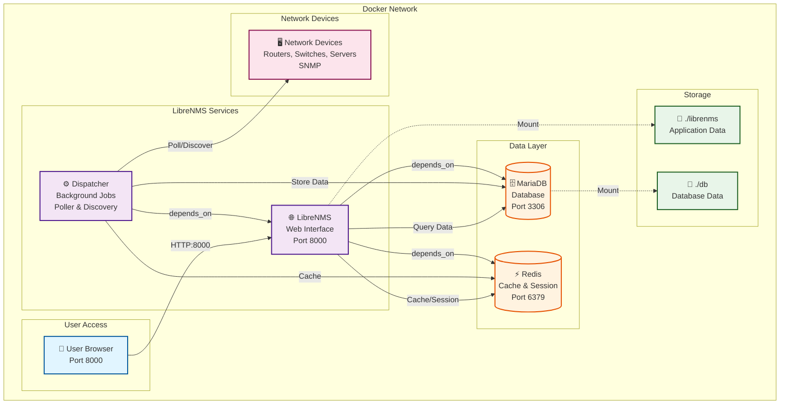
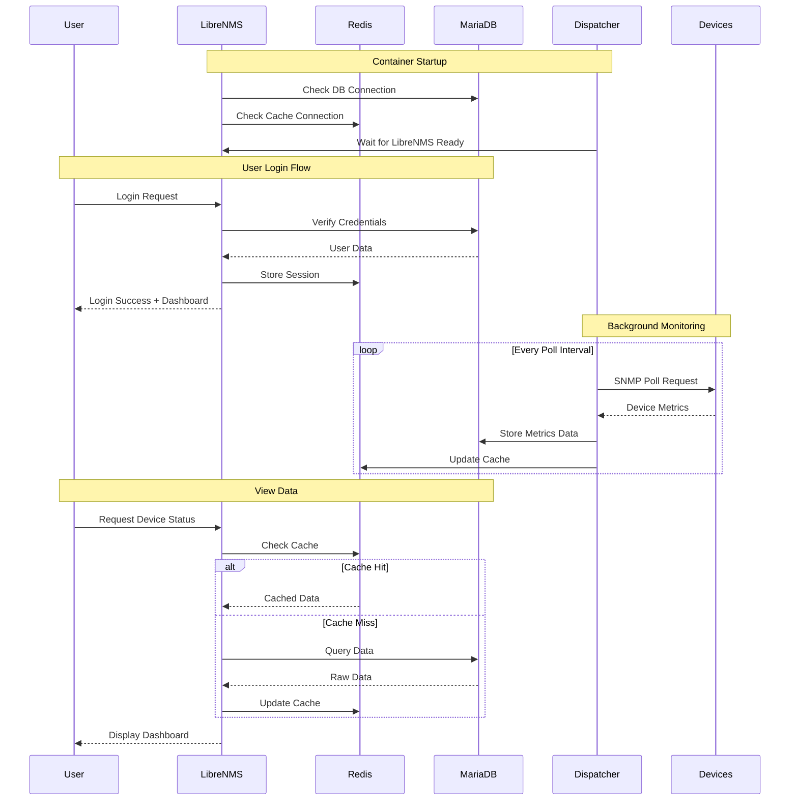
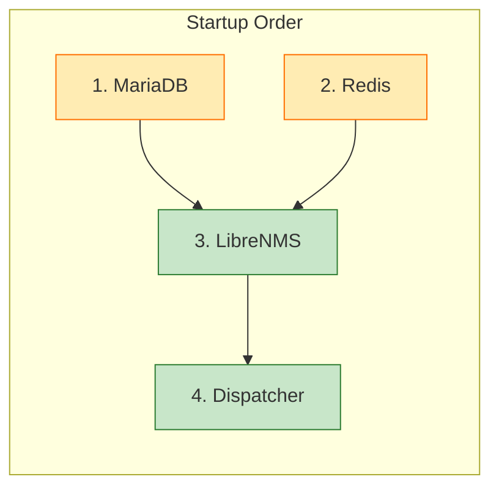

# 📊 LibreNMS Docker Setup - คู่มือฉบับสมบูรณ์

คู่มือการติดตั้งและใช้งาน LibreNMS Network Monitoring System ด้วย Docker Compose

---

## 📋 สารบัญ

- [Architecture Overview](#architecture-overview)
- [ภาพรวมโปรเจค](#ภาพรวมโปรเจค)
- [ส่วนประกอบของระบบ](#ส่วนประกอบของระบบ)
- [ข้อกำหนดเบื้องต้น](#ข้อกำหนดเบื้องต้น)
- [การติดตั้งและใช้งาน](#การติดตั้งและใช้งาน)
- [การสร้าง User บน LibreNMS](#การสร้าง-user-บน-librenms)
- [การเข้าถึงระบบ](#การเข้าถึงระบบ)
- [คำสั่งที่ใช้บ่อย](#คำสั่งที่ใช้บ่อย)
- [การแก้ไขปัญหา](#การแก้ไขปัญหา)
- [ข้อมูลเพิ่มเติม](#ข้อมูลเพิ่มเติม)

---

## 🏗️ Architecture Overview

### Container Architecture Diagram



### Data Flow Diagram



### Container Dependencies



---

## 🎯 ภาพรวมโปรเจค

LibreNMS เป็นระบบ Network Monitoring แบบ Open Source ที่ใช้สำหรับ:

- ✅ ติดตามสถานะของอุปกรณ์เครือข่าย (Routers, Switches, Servers)
- 🔔 แจ้งเตือนเมื่อมีปัญหา (Alert & Notification)
- 📈 เก็บข้อมูล Performance และ Traffic
- 📊 สร้างกราฟและรายงานต่างๆ
- 🔍 Auto-discovery อุปกรณ์ในเครือข่าย
- 📱 รองรับ SNMP, ICMP และโปรโตคอลต่างๆ

โปรเจคนี้ใช้ Docker Compose เพื่อให้การติดตั้งและจัดการง่ายขึ้น พร้อม orchestration ของ 4 containers หลัก

---

## 🧩 ส่วนประกอบของระบบ

### 📦 Container Components

| Container | Image | Role | Ports | Volume |
|-----------|-------|------|-------|--------|
| **librenms_db** | mariadb:10.11 | ฐานข้อมูลหลัก | 3306 (Internal) | `./db` |
| **librenms_redis** | redis:7-alpine | Cache & Session | 6379 (Internal) | - |
| **librenms** | librenms/librenms:latest | Web Interface | 8000 → 8000 | `./librenms` |
| **librenms_dispatcher** | librenms/librenms:latest | Background Worker | - | `./librenms` |

### 1. 🗄️ MariaDB (db)

**บทบาท:** ฐานข้อมูลสำหรับเก็บข้อมูล LibreNMS

**ข้อมูลที่เก็บ:**
- ข้อมูลอุปกรณ์ (Devices)
- Metrics และ Performance data
- Alert history
- User accounts และ permissions
- Configuration settings

**Configuration:**
- Character set: UTF8MB4
- Collation: utf8mb4_unicode_ci
- Timezone: Asia/Bangkok
- InnoDB file-per-table: Enabled

**Credentials:**
- Username: `librenms`
- Password: `librenms`
- Database: `librenms`

### 2. ⚡ Redis (redis)

**บทบาท:** Cache และ Session storage

**ใช้งานสำหรับ:**
- Session management (เก็บ login sessions)
- Query result caching
- Lock mechanism สำหรับ distributed tasks
- Queue management

**Performance Benefits:**
- ลดการ query ฐานข้อมูลซ้ำๆ
- เพิ่มความเร็วในการโหลดหน้าเว็บ
- รองรับ concurrent users ได้ดีขึ้น

### 3. 🌐 LibreNMS (librenms)

**บทบาท:** Web Interface หลัก

**Features:**
- Dashboard และ visualization
- Device management interface
- Alert configuration
- User management
- API endpoint
- Web GUI สำหรับดูข้อมูลและจัดการระบบ

**Capabilities:**
- NET_ADMIN: สำหรับ network operations
- NET_RAW: สำหรับ ICMP ping และ raw sockets

**Access:**
- URL: `http://localhost:8000`
- Protocol: HTTP

### 4. ⚙️ Dispatcher (dispatcher)

**บทบาท:** Background job processor

**งานที่ทำ:**
- **Polling:** เก็บข้อมูลจากอุปกรณ์ทุก 5 นาที (default)
- **Discovery:** ค้นหาอุปกรณ์และ services ใหม่
- **Alerting:** ตรวจสอบและส่ง alerts
- **DB maintenance:** ล้างข้อมูลเก่า
- **Oxidized integration:** Backup device configs

**ทำงานแบบ:**
- Background service (daemon)
- ไม่มี web interface
- ทำงานอิสระจาก web container

---

## ✅ ข้อกำหนดเบื้องต้น

### Software Requirements

ก่อนเริ่มต้น ต้องติดตั้งโปรแกรมต่อไปนี้:

- [Docker](https://docs.docker.com/get-docker/) (Version 20.10+)
- [Docker Compose](https://docs.docker.com/compose/install/) (Version 2.0+)

### ตรวจสอบการติดตั้ง

```bash
docker --version
# Expected: Docker version 20.10.x or higher

docker-compose --version
# Expected: Docker Compose version v2.x.x or higher
```

### System Requirements

**Minimum:**
- CPU: 2 cores
- RAM: 2 GB
- Disk: 10 GB

**Recommended:**
- CPU: 4 cores
- RAM: 4 GB
- Disk: 20 GB (depends on number of devices)

### Network Requirements

- Port 8000 ต้องว่าง (สำหรับ Web UI)
- Internet connection (สำหรับ pull Docker images)
- SNMP access ไปยังอุปกรณ์ที่ต้องการ monitor

---

## 🔒 Security Setup (สำหรับ Production)

> ⚠️ **สำคัญ:** Configuration ที่อยู่ใน `docker-compose.yml` ออกแบบมาสำหรับ Workshop/การเรียนรู้เท่านั้น
>
> หากต้องการใช้งานจริงใน Production **ต้องปรับปรุงความปลอดภัยก่อน!**

### วิธีตั้งค่าที่ปลอดภัย

#### 1. สร้างไฟล์ .env

```bash
# Copy ไฟล์ตัวอย่าง
cp .env.example .env

# แก้ไขไฟล์ .env
nano .env  # หรือใช้ text editor ที่คุณชอบ
```

#### 2. เปลี่ยนรหัสผ่านทั้งหมด

แก้ไขใน `.env` file:

```bash
# สร้างรหัสผ่านที่แข็งแรง (ตัวอย่างการสร้าง)
openssl rand -base64 16

# ใส่ค่าที่ได้ลงในไฟล์ .env
MYSQL_ROOT_PASSWORD=<รหัสผ่านที่สร้างใหม่>
MYSQL_PASSWORD=<รหัสผ่านที่สร้างใหม่>
DB_PASSWORD=<ใช้ค่าเดียวกับ MYSQL_PASSWORD>

# สร้าง APP_KEY (32 characters)
openssl rand -base64 32
APP_KEY=<paste ค่าที่ได้>

# สร้าง Redis Password
openssl rand -base64 16
REDIS_PASSWORD=<paste ค่าที่ได้>

# เปลี่ยน SNMP Community (อย่าใช้ "public")
LIBRENMS_SNMP_COMMUNITY=<คำที่ไม่มีใครเดาได้>
```

#### 3. จำกัดการเข้าถึง (Optional)

หากต้องการให้เข้าถึงได้เฉพาะ localhost แก้ไขใน `.env`:

```bash
# แทนที่จะเปิด port 8000 ให้ทุกคนเข้าถึง
LIBRENMS_PORT=127.0.0.1:8000
```

#### 4. ตั้งค่า Firewall

```bash
# Ubuntu/Debian
sudo ufw allow from 192.168.56.0/24 to any port 8000

# หรือเปิดเฉพาะ IP เครื่อง MikroTik
sudo ufw allow from 192.168.56.10 to any port 8000
```

### ✅ Security Checklist

ก่อนใช้งาน Production ตรวจสอบว่าทำครบทุกข้อแล้ว:

- [ ] สร้างไฟล์ `.env` จาก `.env.example`
- [ ] เปลี่ยน `MYSQL_ROOT_PASSWORD` และ `MYSQL_PASSWORD`
- [ ] สร้างและตั้งค่า `APP_KEY`
- [ ] ตั้งค่า `REDIS_PASSWORD`
- [ ] เปลี่ยน `LIBRENMS_SNMP_COMMUNITY` จาก "public"
- [ ] จำกัดการเข้าถึง port ด้วย Firewall
- [ ] เปลี่ยนรหัสผ่าน admin user ให้แข็งแรง
- [ ] พิจารณาใช้ HTTPS/SSL (ผ่าน reverse proxy เช่น Nginx)

### 🎓 สำหรับ Workshop

**ไม่ต้องกังวล!** สำหรับการเรียนรู้ คุณสามารถข้ามขั้นตอนด้านบนและรันด้วยคำสั่ง `docker-compose up -d` ได้เลย

Docker Compose จะใช้ค่า default ที่กำหนดไว้ใน `docker-compose.yml` อัตโนมัติ

---

## 🚀 การติดตั้งและใช้งาน

### Quick Start

```bash
# 1. Clone repository
git clone <repository-url>
cd wunca46buu/librenms

# 2. Start containers
docker-compose up -d

# 3. Check status
docker-compose ps

# 4. View logs
docker-compose logs -f

# 5. Create admin user
docker exec librenms lnms user:add admin -p YourPassword --role admin

# 6. Access web interface
# Open browser: http://localhost:8000
```

### Step-by-Step Installation

#### 1. Clone Repository

```bash
git clone <repository-url>
cd wunca46buu
```

#### 2. เข้าไปยัง Directory ที่มี docker-compose.yml

```bash
cd librenms
```

#### 3. (Optional) ปรับแต่ง Configuration

แก้ไขไฟล์ `docker-compose.yml` หากต้องการเปลี่ยนค่า:

```yaml
# เปลี่ยน port (ถ้า 8000 ถูกใช้แล้ว)
ports:
  - "8080:8000"

# เปลี่ยน database password
environment:
  MYSQL_PASSWORD: "your-secure-password"
  DB_PASSWORD: "your-secure-password"

# เปลี่ยน timezone
environment:
  TZ: "Asia/Bangkok"
```

#### 4. สร้างและเริ่มต้น Containers

```bash
docker-compose up -d
```

**คำอธิบาย flags:**
- `up` = สร้างและเริ่มต้น containers
- `-d` = รันในโหมด detached (background)

**สิ่งที่เกิดขึ้น:**
1. Pull Docker images (ครั้งแรกจะใช้เวลานาน)
2. สร้าง network สำหรับ containers
3. สร้าง volumes สำหรับเก็บข้อมูล
4. Start containers ตามลำดับ dependencies

#### 5. ตรวจสอบสถานะ Containers

```bash
docker-compose ps
```

**Output ที่ถูกต้อง:**
```
NAME                   STATUS    PORTS
librenms_db            Up        3306/tcp
librenms_redis         Up        6379/tcp
librenms               Up        0.0.0.0:8000->8000/tcp
librenms_dispatcher    Up        -
```

คุณควรเห็น 4 containers ที่มีสถานะ `Up` ทั้งหมด

#### 6. ดูการทำงานของ Containers (Logs)

```bash
# ดู logs ของทุก containers
docker-compose logs -f

# ดู logs ของ librenms เท่านั้น
docker-compose logs -f librenms

# ดู logs 100 บรรทัดล่าสุด
docker-compose logs --tail=100

# ดู logs พร้อม timestamp
docker-compose logs -f -t
```

**กด `Ctrl+C` เพื่อออกจากโหมดดู logs**

#### 7. รอให้ระบบเริ่มต้นเสร็จสมบูรณ์

รอประมาณ **2-5 นาที** เพื่อให้ระบบเริ่มต้นและสร้างฐานข้อมูลเสร็จสมบูรณ์

**ตรวจสอบว่าพร้อมใช้งาน:**
```bash
# ตรวจสอบว่า LibreNMS พร้อมหรือยัง
docker exec librenms lnms validate
```

---

## 👤 การสร้าง User บน LibreNMS

มี 2 วิธีหลักในการสร้าง Admin User

### วิธีที่ 1: ใช้ lnms Command (แนะนำ)

#### สร้าง Admin User

```bash
docker exec librenms lnms user:add <username> -p <password> --role admin
```

**ตัวอย่าง:**
```bash
docker exec librenms lnms user:add admin -p MySecurePass123! --role admin
```

**Output:**
```
User admin added successfully
```

#### ตัวเลือกเพิ่มเติม

```bash
# สร้าง user พร้อม email
docker exec librenms lnms user:add admin -p Pass123! --role admin --email admin@example.com

# สร้าง read-only user
docker exec librenms lnms user:add viewer -p Pass123! --role global-read

# สร้าง normal user
docker exec librenms lnms user:add user1 -p Pass123! --role user
```

### วิธีที่ 2: ใช้ adduser.php Script

#### สร้าง Admin User แบบ Interactive

```bash
docker exec -it librenms php /opt/librenms/adduser.php
```

**ระบบจะถามข้อมูลทีละขั้น:**
```
Username: admin
Password: [จะไม่แสดงขณะพิมพ์]
Level (1-10): 10
Email: admin@example.com
```

#### สร้าง Admin User แบบ One-line Command

```bash
docker exec librenms php /opt/librenms/adduser.php <username> <password> <level> <email>
```

**ตัวอย่าง:**
```bash
docker exec librenms php /opt/librenms/adduser.php admin MySecurePass123! 10 admin@example.com
```

### ระดับสิทธิ์ (User Levels)

| Level | Role | คำอธิบาย | Use Case |
|-------|------|----------|----------|
| **10** | Admin | สิทธิ์เต็ม สามารถจัดการทุกอย่างได้ | System Administrator |
| **5** | Global Read | อ่านได้ทุกอย่าง แต่แก้ไขไม่ได้ | Viewer, Reporter |
| **1** | Normal User | สิทธิ์จำกัด ดูเฉพาะอุปกรณ์ที่กำหนด | Limited Access User |

### จัดการ Users

```bash
# ดูรายการ users ทั้งหมด
docker exec librenms lnms user:list

# ลบ user
docker exec librenms lnms user:remove <username>

# เปลี่ยนรหัสผ่าน (ผ่าน Web UI)
# Settings → Manage Users → Edit User → Change Password
```

---

## 🌐 การเข้าถึงระบบ

### Web Interface Access

เปิดเว็บเบราว์เซอร์และเข้าไปที่:

**Local Access:**
```
http://localhost:8000
```

**Remote Access:**
```
http://<server-ip>:8000
```

**ตัวอย่าง:**
```
http://192.168.1.100:8000
```

### หน้า Login


**ขั้นตอน:**
1. กรอก **Username** ที่สร้างไว้
2. กรอก **Password**
3. (Optional) เลือก "Remember Me" ถ้าต้องการ
4. กด **Login**

### หลังจาก Login สำเร็จ

คุณจะเห็นหน้า **Dashboard** ที่แสดง:

#### Main Dashboard Components:

1. **Overview Section**
   - Device count (Total, Up, Down)
   - Port statistics
   - Service status

2. **Alert Summary**
   - Active alerts
   - Alert history
   - Acknowledged alerts

3. **Device List**
   - Recently added devices
   - Device status
   - Quick access links

4. **Graphs & Charts**
   - Traffic graphs
   - CPU/Memory usage
   - Custom dashboards

#### Navigation Menu:

| Menu | Description |
|------|-------------|
| **Dashboard** | หน้าหลัก Overview |
| **Devices** | จัดการและดูอุปกรณ์ |
| **Services** | ดู Services ที่ monitor |
| **Ports** | ดู Network ports |
| **Alerts** | จัดการ Alerts และ Rules |
| **Graphs** | ดูกราฟต่างๆ |
| **Settings** | ตั้งค่าระบบ (Admin only) |

---

## 🔧 คำสั่งที่ใช้บ่อย

### จัดการ Docker Compose

#### เริ่มต้น/หยุด Services

```bash
# เริ่มต้น services ทั้งหมด
docker-compose up -d

# เริ่มต้นแบบเห็น logs
docker-compose up

# หยุด services ทั้งหมด (containers ยังอยู่)
docker-compose stop

# เริ่มต้น services ที่หยุดไว้
docker-compose start

# รีสตาร์ท services ทั้งหมด
docker-compose restart

# รีสตาร์ทเฉพาะ service ใดๆ
docker-compose restart librenms
docker-compose restart db
```

#### ลบ Containers

```bash
# หยุดและลบ containers (ข้อมูลใน volumes ยังอยู่)
docker-compose down

# ลบ containers และ volumes (ระวัง! ข้อมูลจะหายหมด)
docker-compose down -v

# ลบ containers, volumes และ images
docker-compose down -v --rmi all
```

#### ดูสถานะและ Logs

```bash
# ดูสถานะ containers
docker-compose ps

# ดู logs แบบ real-time
docker-compose logs -f

# ดู logs ของ service เดียว
docker-compose logs -f librenms

# ดู logs 100 บรรทัดล่าสุด
docker-compose logs --tail=100

# ดู logs พร้อม timestamp
docker-compose logs -t -f

# ค้นหา error ใน logs
docker-compose logs | grep -i error
```

#### อัปเดตและบำรุงรักษา

```bash
# Pull images ใหม่
docker-compose pull

# อัปเดต containers ด้วย images ใหม่
docker-compose up -d

# ดูขนาด volumes
docker-compose exec librenms du -sh /data

# Backup volumes
tar -czf backup-$(date +%Y%m%d).tar.gz ./librenms ./db
```

### จัดการ LibreNMS

#### เข้าสู่ Container

```bash
# เข้า shell ของ librenms container
docker exec -it librenms bash

# เข้า shell ของ database container
docker exec -it librenms_db bash

# เข้า redis-cli
docker exec -it librenms_redis redis-cli
```

#### Validation และ Maintenance

```bash
# รัน validate เพื่อตรวจสอบ configuration
docker exec librenms lnms validate

# รัน database migration
docker exec librenms lnms migrate

# ล้าง cache
docker exec librenms lnms cache:clear

# ตรวจสอบ version
docker exec librenms lnms version
```

#### Device Management

```bash
# เพิ่มอุปกรณ์ใหม่ผ่าน CLI
docker exec librenms lnms device:add <hostname> --community <snmp-community>

# ตัวอย่าง: เพิ่ม router
docker exec librenms lnms device:add 192.168.1.1 --community public

# เพิ่มอุปกรณ์พร้อม SNMP v3
docker exec librenms lnms device:add <hostname> \
  --v3 \
  --authlevel authPriv \
  --authname <username> \
  --authpass <password> \
  --cryptopass <crypto-password>

# ลบอุปกรณ์
docker exec librenms lnms device:remove <hostname>

# ดูรายการอุปกรณ์ทั้งหมด
docker exec librenms lnms device:list

# Poll อุปกรณ์ทันที
docker exec librenms lnms device:poll <device-id>
```

#### User Management

```bash
# ดูรายการ users ทั้งหมด
docker exec librenms lnms user:list

# เพิ่ม user ใหม่
docker exec librenms lnms user:add <username> -p <password> --role admin

# ลบ user
docker exec librenms lnms user:remove <username>
```

### ดูข้อมูล Database

#### เข้า MariaDB Shell

```bash
# เข้า MariaDB shell ด้วย librenms user
docker exec -it librenms_db mysql -u librenms -plibrenms librenms

# เข้าด้วย root user
docker exec -it librenms_db mysql -u root
```

#### คำสั่ง SQL ที่มีประโยชน์

```sql
-- ดูจำนวนอุปกรณ์
SELECT COUNT(*) FROM devices;

-- ดูอุปกรณ์ทั้งหมด
SELECT hostname, status, location FROM devices;

-- ดู users
SELECT username, level, email FROM users;

-- ดูขนาดฐานข้อมูล
SELECT
    table_schema AS 'Database',
    ROUND(SUM(data_length + index_length) / 1024 / 1024, 2) AS 'Size (MB)'
FROM information_schema.tables
WHERE table_schema = 'librenms'
GROUP BY table_schema;

-- ดูตาราง 10 อันดับที่ใหญ่ที่สุด
SELECT
    table_name AS 'Table',
    ROUND(((data_length + index_length) / 1024 / 1024), 2) AS 'Size (MB)'
FROM information_schema.tables
WHERE table_schema = 'librenms'
ORDER BY (data_length + index_length) DESC
LIMIT 10;
```

### Backup และ Restore

#### Backup

```bash
# Backup ทั้งระบบ (แนะนำ: หยุด containers ก่อน)
docker-compose stop
tar -czf librenms-backup-$(date +%Y%m%d-%H%M%S).tar.gz ./librenms ./db
docker-compose start

# Backup เฉพาะ database
docker exec librenms_db mysqldump -u librenms -plibrenms librenms > backup.sql

# Backup แบบ running (ไม่ต้องหยุด containers)
docker exec librenms_db mysqldump -u librenms -plibrenms librenms | gzip > backup-$(date +%Y%m%d).sql.gz
```

#### Restore

```bash
# Restore จาก tar backup
docker-compose down
tar -xzf librenms-backup-YYYYMMDD-HHMMSS.tar.gz
docker-compose up -d

# Restore database
docker exec -i librenms_db mysql -u librenms -plibrenms librenms < backup.sql

# Restore จาก gzip
gunzip < backup-YYYYMMDD.sql.gz | docker exec -i librenms_db mysql -u librenms -plibrenms librenms
```

---

## 🔍 การแก้ไขปัญหา

### ปัญหา: Containers ไม่สามารถเริ่มได้

**อาการ:**
- Container ไม่ start หรือ restart ซ้ำๆ
- Error ใน `docker-compose ps`

**วิธีแก้:**

```bash
# 1. ตรวจสอบ logs เพื่อดูข้อผิดพลาด
docker-compose logs

# 2. ตรวจสอบ container ที่มีปัญหา
docker-compose logs -f <container-name>

# 3. ลองลบและสร้างใหม่
docker-compose down
docker-compose up -d

# 4. ตรวจสอบว่า port ถูกใช้หรือไม่
netstat -tulpn | grep 8000
lsof -i :8000  # On macOS/Linux

# 5. ตรวจสอบ disk space
df -h

# 6. ตรวจสอบ Docker resources
docker system df
```

**สาเหตุที่พบบ่อย:**
- Port 8000 ถูกใช้โดยโปรแกรมอื่น
- Disk เต็ม
- Permissions issue กับ volumes
- Docker daemon ไม่ทำงาน

---

### ปัญหา: ลืมรหัสผ่าน Admin

**อาการ:**
- ไม่สามารถ login ได้
- ลืมรหัสผ่าน admin

**วิธีแก้ 1: สร้าง admin user ใหม่**

```bash
docker exec librenms lnms user:add newadmin -p NewPassword123! --role admin
```

**วิธีแก้ 2: Reset รหัสผ่านใน database**

```bash
# เข้า database
docker exec -it librenms_db mysql -u librenms -plibrenms librenms

# Reset password (ใน MySQL shell)
UPDATE users SET password = '$2y$10$92IXUNpkjO0rOQ5byMi.Ye4oKoEa3Ro9llC/.og/at2.uheWG/igi' WHERE username = 'admin';
# Password จะเป็น: password

# Exit
exit
```

จากนั้น login ด้วย password ใหม่และเปลี่ยนทันที

---

### ปัญหา: Database Connection Error

**อาการ:**
- LibreNMS แสดง "Database connection failed"
- Error ใน logs เกี่ยวกับ MySQL/MariaDB

**วิธีแก้:**

```bash
# 1. ตรวจสอบว่า db container ทำงานหรือไม่
docker-compose ps

# 2. ตรวจสอบ logs ของ database
docker-compose logs db

# 3. ตรวจสอบการเชื่อมต่อจาก librenms container
docker exec librenms ping -c 3 db
docker exec librenms nc -zv db 3306

# 4. รีสตาร์ท db และ librenms (รอให้ db พร้อมก่อน)
docker-compose restart db
sleep 10
docker-compose restart librenms

# 5. ตรวจสอบ credentials ใน docker-compose.yml
cat docker-compose.yml | grep -A 5 "MYSQL_"
cat docker-compose.yml | grep -A 5 "DB_"
```

**ถ้ายังไม่ได้:**

```bash
# Rebuild containers
docker-compose down
docker-compose up -d

# ตรวจสอบว่า database สร้างเสร็จหรือยัง
docker exec librenms_db mysql -u librenms -plibrenms -e "SHOW DATABASES;"
```

---

### ปัญหา: Port 8000 ถูกใช้แล้ว

**อาการ:**
- Error: "bind: address already in use"
- ไม่สามารถ start librenms container

**ตรวจสอบว่าโปรแกรมไหนใช้ port:**

```bash
# Linux
netstat -tulpn | grep 8000
sudo lsof -i :8000

# Windows (PowerShell)
netstat -ano | findstr :8000

# macOS
lsof -i :8000
```

**วิธีแก้ 1: เปลี่ยน port**

แก้ไขไฟล์ `docker-compose.yml`:

```yaml
ports:
  - "8080:8000"  # เปลี่ยนจาก 8000 เป็น 8080
```

จากนั้น:
```bash
docker-compose down
docker-compose up -d
```

เข้าใช้งานที่ `http://localhost:8080`

**วิธีแก้ 2: หยุดโปรแกรมที่ใช้ port**

```bash
# Linux
sudo kill -9 <PID>

# Windows (PowerShell as Admin)
Stop-Process -Id <PID> -Force
```

---

### ปัญหา: LibreNMS ช้า / Performance Issue

**อาการ:**
- Web interface โหลดช้า
- Graphs ไม่แสดงผล
- Poller lag

**วิธีแก้:**

```bash
# 1. ตรวจสอบ resources
docker stats

# 2. เพิ่ม resources ให้ Docker (ถ้าจำเป็น)
# Docker Desktop → Settings → Resources → เพิ่ม CPU/Memory

# 3. ตรวจสอบ Redis
docker exec librenms_redis redis-cli ping
# ควรได้ "PONG"

# 4. Clear cache
docker exec librenms lnms cache:clear

# 5. ตรวจสอบ poller performance
docker exec librenms lnms device:poller-status

# 6. Optimize database
docker exec librenms_db mysql -u librenms -plibrenms librenms -e "OPTIMIZE TABLE devices;"
```

**ปรับแต่ง Poller:**

แก้ไข `docker-compose.yml`:

```yaml
dispatcher:
  environment:
    DISPATCHER_NODE_ID: "dispatcher1"
    SIDECAR_DISPATCHER: "1"
    # เพิ่ม workers (default: 16)
    LIBRENMS_POLLER_THREADS: "32"
```

---

### ปัญหา: Dispatcher ไม่ทำงาน / Poller Not Running

**อาการ:**
- อุปกรณ์ไม่ถูก poll
- ไม่มีข้อมูลใหม่ใน graphs
- Alert ไม่ทำงาน

**วิธีแก้:**

```bash
# 1. ตรวจสอบสถานะ dispatcher
docker-compose ps dispatcher

# 2. ดู logs ของ dispatcher
docker-compose logs -f dispatcher

# 3. รีสตาร์ท dispatcher
docker-compose restart dispatcher

# 4. ตรวจสอบว่า poller ทำงานหรือไม่
docker exec librenms lnms device:poller-status

# 5. Test poll อุปกรณ์ทันที
docker exec librenms lnms device:poll <device-id> -vvv
```

---

### ปัญหา: SNMP ไม่ทำงาน / Cannot Add Device

**อาการ:**
- ไม่สามารถเพิ่มอุปกรณ์ได้
- Error: "SNMP check failed"

**วิธีแก้:**

```bash
# 1. ทดสอบ SNMP จาก container
docker exec librenms snmpwalk -v 2c -c public <device-ip> system

# 2. ตรวจสอบ SNMP community
# ใน docker-compose.yml
LIBRENMS_SNMP_COMMUNITY: "public"

# 3. ทดสอบ connectivity
docker exec librenms ping -c 3 <device-ip>

# 4. ตรวจสอบ firewall
# ต้องเปิด UDP port 161 (SNMP) บนอุปกรณ์

# 5. เพิ่มอุปกรณ์พร้อม force
docker exec librenms lnms device:add <hostname> --community public --force
```

**ตรวจสอบการตั้งค่า SNMP บนอุปกรณ์:**
- SNMP enabled
- Community string ถูกต้อง
- ACL/Firewall อนุญาตให้ LibreNMS เข้าถึง

---

### ปัญหา: Volume Permissions Error

**อาการ:**
- Error: "Permission denied"
- ไม่สามารถเขียนไฟล์ใน volume

**วิธีแก้:**

```bash
# Linux/macOS
# 1. ตรวจสอบ ownership
ls -la ./librenms ./db

# 2. แก้ไข permissions (ระวัง: อาจส่งผลกับ security)
sudo chown -R 1000:1000 ./librenms
sudo chown -R 999:999 ./db

# 3. หรือใช้ root user ใน docker-compose.yml (ไม่แนะนำ)
services:
  librenms:
    user: root
    environment:
      PUID: "0"
      PGID: "0"
```

---

### ปัญหา: ต้องการ Reset ระบบทั้งหมด

**คำเตือน: ข้อมูลทั้งหมดจะถูกลบ ไม่สามารถกู้คืนได้**

```bash
# 1. Backup ก่อน (ถ้าต้องการ)
docker-compose stop
tar -czf backup-before-reset-$(date +%Y%m%d).tar.gz ./librenms ./db
docker-compose start

# 2. หยุดและลบทุกอย่าง
docker-compose down -v

# 3. ลบ volumes บน disk
rm -rf ./db ./librenms

# 4. สร้างใหม่ทั้งหมด
docker-compose up -d

# 5. รอให้ระบบเริ่มต้น
sleep 120

# 6. สร้าง admin user ใหม่
docker exec librenms lnms user:add admin -p AdminPass123! --role admin
```

---

### ปัญหา: Cannot Access Web Interface (404/502 Error)

**อาการ:**
- เข้า http://localhost:8000 ไม่ได้
- Error 404 หรือ 502 Bad Gateway

**วิธีแก้:**

```bash
# 1. ตรวจสอบว่า container ทำงาน
docker-compose ps

# 2. ตรวจสอบ port binding
docker port librenms

# 3. ทดสอบจากภายใน container
docker exec librenms curl -I localhost:8000

# 4. ตรวจสอบ nginx/apache logs
docker-compose logs librenms | grep -i error

# 5. รีสตาร์ท librenms
docker-compose restart librenms

# 6. ตรวจสอบ firewall (ถ้ารันบน server)
# Linux
sudo ufw status
sudo ufw allow 8000/tcp
```

---

### ปัญหา: High Disk Usage

**อาการ:**
- Volume ใช้พื้นที่มาก
- Disk เต็ม

**วิธีแก้:**

```bash
# 1. ตรวจสอบขนาด
du -sh ./librenms ./db
docker system df -v

# 2. ล้างข้อมูลเก่าใน database
docker exec librenms lnms config:set alert_log_purge 30
docker exec librenms lnms config:set eventlog_purge 30

# 3. ล้าง RRD files เก่า (ถ้ามี)
docker exec librenms find /data/rrd -name "*.rrd" -mtime +365 -delete

# 4. ล้าง logs
docker exec librenms find /data/logs -name "*.log" -mtime +30 -delete

# 5. Optimize database
docker exec librenms_db mysqlcheck -u librenms -plibrenms --optimize --all-databases

# 6. ล้าง Docker unused data
docker system prune -a
```

---

## 📞 ข้อมูลเพิ่มเติม

### Default Configuration

| Item | Value | Description |
|------|-------|-------------|
| **Web Port** | 8000 | HTTP access port |
| **Database Name** | librenms | MariaDB database name |
| **Database User** | librenms | Database username |
| **Database Password** | librenms | Database password (แนะนำเปลี่ยน) |
| **Timezone** | Asia/Bangkok | System timezone |
| **SNMP Community** | public | Default SNMP community string |
| **SNMP Version** | v2c | Default SNMP version |
| **Poll Interval** | 5 minutes | Device polling interval |
| **Discovery Interval** | 4 hours | Network discovery interval |

### Environment Variables

#### LibreNMS Container

```yaml
TZ: "Asia/Bangkok"           # Timezone
PUID: "1000"                 # User ID
PGID: "1000"                 # Group ID
DB_HOST: "db"                # Database hostname
DB_NAME: "librenms"          # Database name
DB_USER: "librenms"          # Database user
DB_PASSWORD: "librenms"      # Database password
DB_TIMEOUT: "60"             # Connection timeout (seconds)
CACHE_DRIVER: "redis"        # Cache driver
SESSION_DRIVER: "redis"      # Session driver
REDIS_HOST: "redis"          # Redis hostname
REDIS_PORT: "6379"           # Redis port
REDIS_DB: "0"                # Redis database number
LIBRENMS_SNMP_COMMUNITY: "public"  # SNMP community
LIBRENMS_WEATHERMAP: "false" # Weathermap plugin
```

#### Dispatcher Container

```yaml
SIDECAR_DISPATCHER: "1"      # Enable dispatcher mode
DISPATCHER_NODE_ID: "dispatcher1"  # Unique node ID
LIBRENMS_POLLER_THREADS: "16"     # Number of poller threads (optional)
```

### Docker Compose Service Dependencies

```
db (MariaDB)
  └── librenms
       └── dispatcher

redis
  └── librenms
       └── dispatcher
```

**Startup Order:**
1. MariaDB และ Redis start พร้อมกัน
2. LibreNMS รอ MariaDB และ Redis พร้อม
3. Dispatcher รอ LibreNMS พร้อม

### Network Ports

| Port | Protocol | Service | Exposed | Description |
|------|----------|---------|---------|-------------|
| 8000 | TCP | LibreNMS Web UI | Yes | HTTP web interface |
| 3306 | TCP | MariaDB | No | Database (internal only) |
| 6379 | TCP | Redis | No | Cache (internal only) |
| 161 | UDP | SNMP | No | SNMP polling (outbound) |

### Storage Volumes

```
Project Directory
├── docker-compose.yml
├── db/                    # MariaDB data
│   ├── mysql/
│   ├── performance_schema/
│   └── librenms/
└── librenms/             # LibreNMS data
    ├── config/           # Configuration files
    ├── rrd/              # RRD database files
    ├── logs/             # Application logs
    └── plugins/          # Plugins
```

**ขนาดโดยประมาณ:**
- Database: 100 MB - 10 GB (ขึ้นกับจำนวนอุปกรณ์และระยะเวลา)
- RRD files: 50 MB - 5 GB (ขึ้นกับจำนวน metrics)
- Logs: 10 MB - 500 MB

### Useful Links

#### Official Documentation
- [LibreNMS Official Docs](https://docs.librenms.org/)
- [LibreNMS Docker Hub](https://hub.docker.com/r/librenms/librenms)
- [LibreNMS GitHub](https://github.com/librenms/librenms)
- [Docker Compose Documentation](https://docs.docker.com/compose/)

#### Community
- [LibreNMS Discord](https://discord.gg/librenms)
- [LibreNMS Community Forum](https://community.librenms.org/)
- [GitHub Issues](https://github.com/librenms/librenms/issues)

#### Tutorials
- [Adding Devices](https://docs.librenms.org/Support/Adding-a-Device/)
- [Alert Rules](https://docs.librenms.org/Alerting/Rules/)
- [API Documentation](https://docs.librenms.org/API/)
- [Performance Tuning](https://docs.librenms.org/Support/Performance/)

### SNMP Configuration Examples

#### Cisco IOS

```
snmp-server community public RO
snmp-server location "Bangkok, Thailand"
snmp-server contact "admin@example.com"
```

#### Linux (Net-SNMP)

```bash
# /etc/snmp/snmpd.conf
rocommunity public
syslocation "Bangkok, Thailand"
syscontact admin@example.com
```

#### Windows

```powershell
# Enable SNMP service
Set-Service SNMP -StartupType Automatic
Start-Service SNMP

# Configure via GUI: Services → SNMP Service → Properties
```

### Best Practices

#### Security

- ✅ เปลี่ยน database password
- ✅ ใช้ strong password สำหรับ admin user
- ✅ ใช้ SNMP v3 แทน v2c เมื่อเป็นไปได้
- ✅ ใช้ Reverse Proxy (nginx/Caddy) พร้อม SSL/TLS
- ✅ จำกัด network access ด้วย firewall
- ✅ Backup ข้อมูลเป็นประจำ

#### Performance

- ✅ เพิ่ม poller threads สำหรับอุปกรณ์จำนวนมาก
- ✅ ใช้ Redis สำหรับ cache (enabled by default)
- ✅ ตั้งค่า appropriate retention period
- ✅ ทำ database optimization เป็นประจำ
- ✅ Monitor disk space

#### Monitoring

- ✅ ตั้งค่า alerts สำหรับเหตุการณ์สำคัญ
- ✅ สร้าง dashboard ตาม use case
- ✅ ใช้ device groups เพื่อจัดการง่าย
- ✅ Document network topology
- ✅ Review logs เป็นประจำ

---

## 📝 License

โปรเจคนี้ใช้งานสำหรับการศึกษาและพัฒนา

LibreNMS is licensed under GPL v3.0

---

## 🤝 Contributing

หากพบปัญหาหรือต้องการปรับปรุงคู่มือ:

1. Fork repository
2. สร้าง branch ใหม่
3. Commit changes
4. สร้าง Pull Request

---

## 📧 Contact

หากมีคำถามหรือต้องการความช่วยเหลือ:

- เปิด Issue บน GitHub
- ติดต่อผ่าน LibreNMS Community Forum
- อ่านเอกสารเพิ่มเติมที่ [LibreNMS Docs](https://docs.librenms.org/)

---

**Happy Monitoring! 🎉**

*Last Updated: 2026-02-09*
