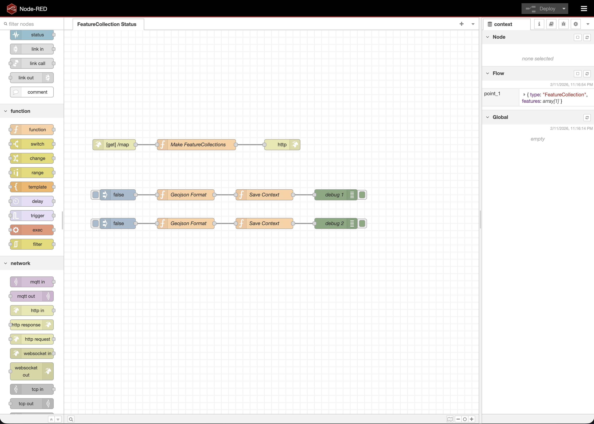

# Node-RED GeoJSON Flow - Training Guide

This flow demonstrates how to create, store, and serve GeoJSON data using Node-RED. It's designed for training purposes to understand GeoJSON format, flow context storage, and HTTP endpoints.

## Flow Overview



This flow creates GeoJSON Point features with status properties, stores them in Node-RED flow context, and serves them as a FeatureCollection via an HTTP endpoint.

## Import Instructions

### Step 1: Access Node-RED

1. Make sure Node-RED is running (using Docker or local installation)
2. Open Node-RED in your browser at `http://localhost:1880`

### Step 2: Import the Flow

1. Click on the **menu icon** (☰) in the top-right corner of Node-RED
2. Select **Import** from the dropdown menu
3. Click **select a file to import** or **clipboard**
4. Open the file `node-geojson-status.json` from this folder
5. Click **Import** button
6. The flow will appear in your workspace

### Step 3: Deploy the Flow

1. Click the **Deploy** button (red button in the top-right corner)
2. The flow is now active and ready to use

## Flow Description

### Components

The flow consists of the following components:

#### 1. **Inject Nodes** (2 nodes)

- **Purpose**: Trigger the flow manually or automatically
- **Configuration**:
  - Sends a boolean value (`false`) as payload
  - Can be triggered by clicking the button on the node
- **Location**: Two inject nodes at the top of the flow

#### 2. **Geojson Format Function Nodes** (2 nodes)

- **Purpose**: Convert boolean status values into GeoJSON Point features
- **Functionality**:
  - Creates a GeoJSON Feature object
  - Sets the `status` property from the input payload
  - Defines Point geometry with coordinates:
    - Point 1: `[102.82754999179139, 16.4448140454746]`
    - Point 2: `[102.79073083181987, 16.4655764596137]`
- **Output**: GeoJSON Feature object

#### 3. **Save Context Function Nodes** (2 nodes)

- **Purpose**: Store GeoJSON features in Node-RED flow context
- **Functionality**:
  - Saves Point 1 to `flow.get("point_1")`
  - Saves Point 2 to `flow.get("point_2")`
  - Uses flow context to persist data between messages
- **Output**: Passes the message to debug nodes

#### 4. **Debug Nodes** (2 nodes)

- **Purpose**: Display output in the debug panel
- **Configuration**: Shows complete message payload
- **Usage**: Click on a debug node to see the GeoJSON feature in the debug sidebar

#### 5. **HTTP In Node**

- **Purpose**: Create an HTTP GET endpoint
- **Configuration**:
  - URL: `/map`
  - Method: GET
- **Usage**: Accessible at `http://localhost:1880/map`

#### 6. **Make FeatureCollections Function Node**

- **Purpose**: Combine stored points into a GeoJSON FeatureCollection
- **Functionality**:
  - Retrieves `point_1` and `point_2` from flow context
  - Creates a FeatureCollection containing both points
  - Formats as valid GeoJSON FeatureCollection
- **Output**: Complete GeoJSON FeatureCollection

#### 7. **HTTP Response Node**

- **Purpose**: Send the FeatureCollection as HTTP response
- **Configuration**: Returns the GeoJSON data with appropriate headers
- **Output**: Serves GeoJSON to HTTP clients

## How to Use

### Testing Individual Points

1. **Click the inject button** on either inject node
2. **Open the Debug panel** (right sidebar, click "debug" tab)
3. **View the output**: You'll see a GeoJSON Feature object with:

   ```json
   {
     "type": "Feature",
     "properties": {
       "status": false
     },
     "geometry": {
       "coordinates": [102.827..., 16.444...],
       "type": "Point"
     }
   }
   ```

### Testing the HTTP Endpoint

1. **Deploy the flow** (if not already deployed)
2. **Open your browser** or use curl:

   ```bash
   curl http://localhost:1880/map
   ```

3. **View the response**: You'll receive a GeoJSON FeatureCollection:

   ```json
   {
     "type": "FeatureCollection",
     "features": [
       {
         "type": "Feature",
         "properties": { "status": false },
         "geometry": {
           "coordinates": [102.827..., 16.444...],
           "type": "Point"
         }
       },
       {
         "type": "Feature",
         "properties": { "status": false },
         "geometry": {
           "coordinates": [102.790..., 16.465...],
           "type": "Point"
         }
       }
     ]
   }
   ```

## Learning Objectives

This flow teaches:

1. **GeoJSON Format**: Understanding Point features and FeatureCollections
2. **Flow Context**: Storing and retrieving data using `flow.set()` and `flow.get()`
3. **HTTP Endpoints**: Creating RESTful APIs with Node-RED
4. **Data Transformation**: Converting simple data types to GeoJSON format
5. **Debugging**: Using debug nodes to inspect message flow

## Customization

### Change Coordinates

Edit the "Geojson Format" function nodes to modify coordinates:

```javascript
"coordinates": [
  102.82754999179139,  // Longitude
  16.4448140454746     // Latitude
]
```

### Add More Points

1. Copy an inject → Geojson Format → Save Context chain
2. Update the Save Context function to use a new key (e.g., `point_3`)
3. Update "Make FeatureCollections" to include the new point:

   ```javascript
   "features": [
     flow.get("point_1"),
     flow.get("point_2"),
     flow.get("point_3")  // Add new point
   ]
   ```

### Change Status Values

Modify the inject nodes to send different payloads (strings, numbers, etc.) to change the status property.

## Troubleshooting

- **Flow not working**: Make sure you clicked Deploy after importing
- **HTTP endpoint not responding**: Check that Node-RED is running and the flow is deployed
- **Empty FeatureCollection**: Make sure you've triggered the inject nodes at least once to populate the flow context
- **Debug panel empty**: Click on the debug nodes to enable them, then trigger the flow

## Next Steps

- Try adding more points with different status values
- Modify the HTTP endpoint to accept query parameters
- Add validation for GeoJSON format
- Integrate with external GeoJSON data sources
- Connect to a map visualization tool (like MapLibre GL JS)
